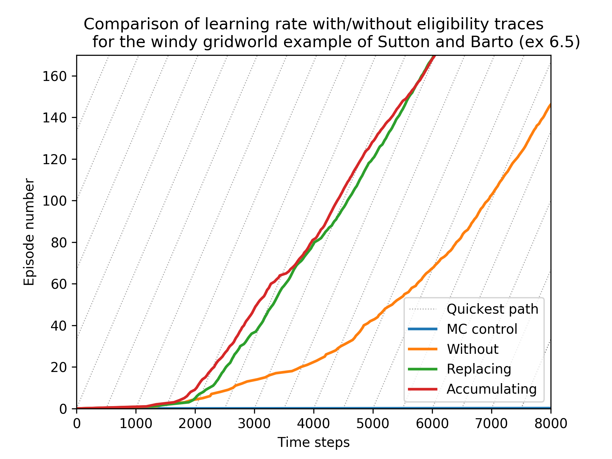

# Gridworld example using different SARSA agents

Reproduction of windy gridworld example by Sutton and Barto (1998) using a range of SARSA agents that learn in different ways.  


The figure below is a reproduction of the windy gridworld example of Sutton and Barto (example 6.5, p130 in [this book](http://incompleteideas.net/book/first/the-book.html)).  The figure (figure 6.11 in the linked book) can be reproduced in Python3 using the following command: 


**Prerequisites**


This script was written using Python3.6 and the Python modules described in [requirements.txt](requirements.txt).  It is recommended to use a virtual environment when running this example.  A virtual environment can be created and activated using `venv` in the following manner:

```bash
python3 -m venv venv
source venv/bin/activate

pip install -r requirements.txt
```


**Usage**


The windy gridworld example can then be run (after activating the virtual environment) using: 

```bash
python gridworld_tabular.py
```


